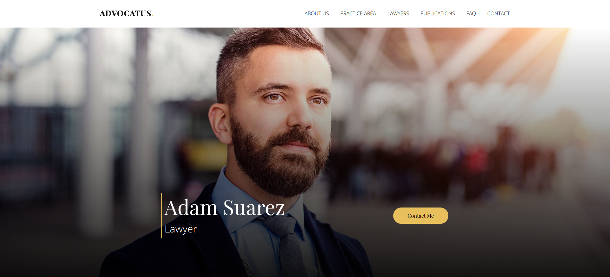

# Advocatus

> Advocatus is an attempted imitation of a mock website with HTML CSS and a little bit of Javascript

> View the mock website [here](https://symu.co/image/pngzkppjprx/1440/10000/fit/original/95/jpg/)

## Table of contents

- [Overview](#overview)
  - [Features](#features)
  - [Screenshot](#screenshot)
  - [Links](#links)
- [My process](#my-process)
  - [Built with](#built-with)
- [Author](#author)

## Overview

### Features

- [x] Able to scroll into view all slides
- [x] Integrated carousel
- [x] Integrated accordion

### Screenshot

### Links

> View the project [here](https://funkosaur.github.io/Cyber-Sketch/)

## My process

### Built with

- HTML5
- CSS
- Flexbox
- CSS Grid
- Desktop-first workflow
- Javascript

## Authors

- Website - [Dimitar Davcev](https://github.com/DimitarDavchev)
- Website - [Mario Boykovski](https://github.com/funkosaur)
 
